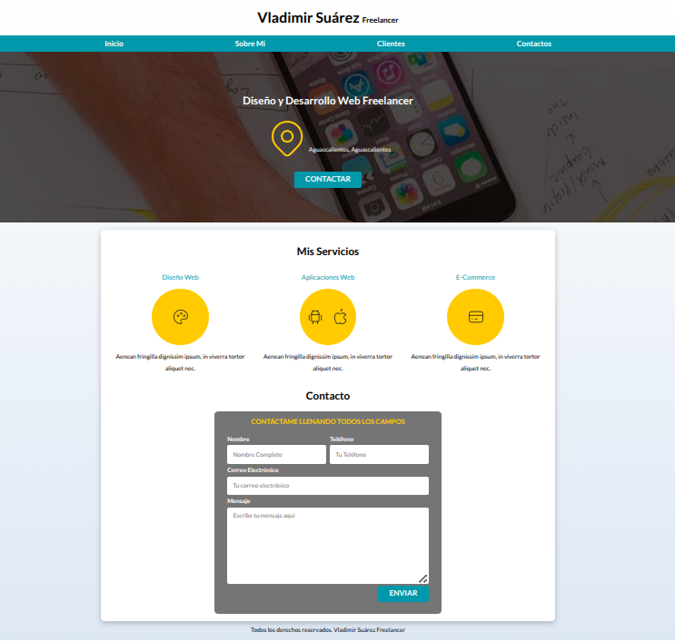
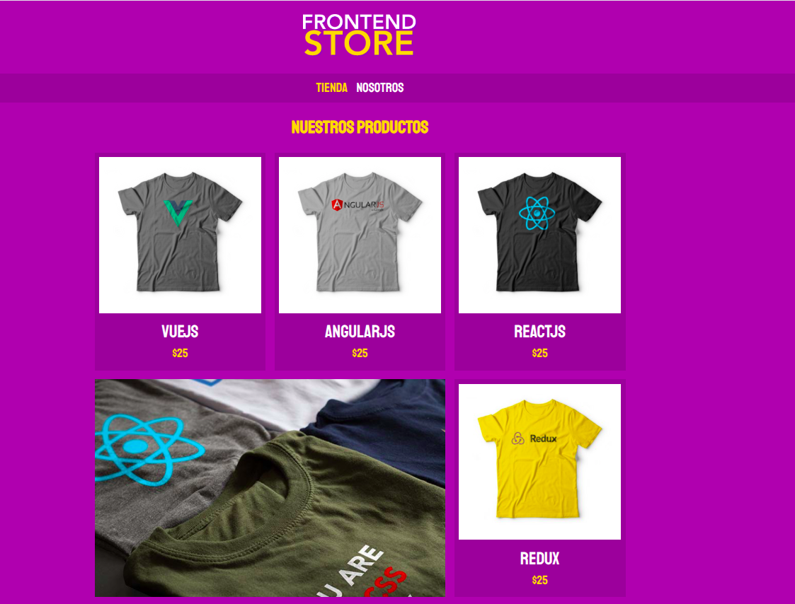
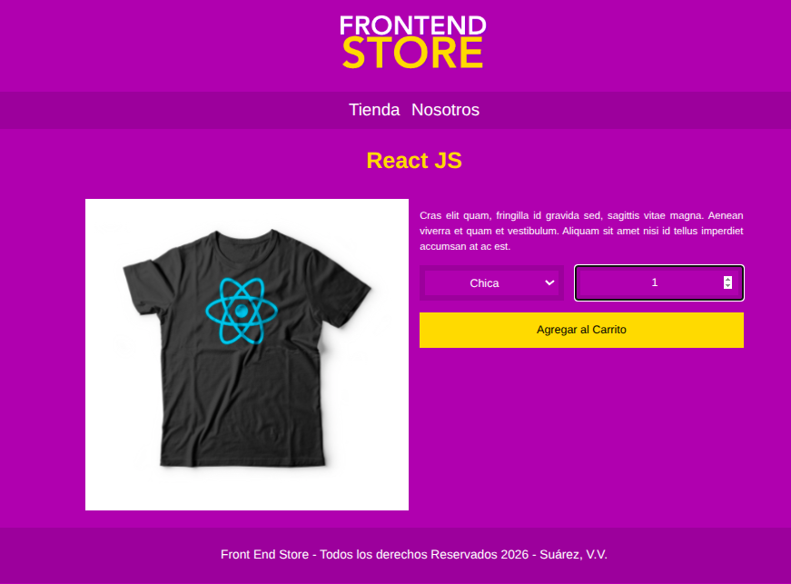
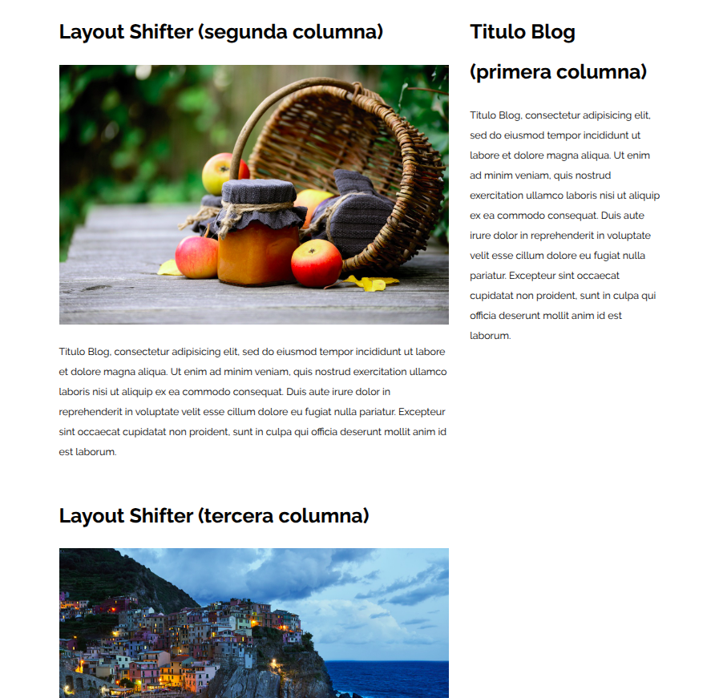
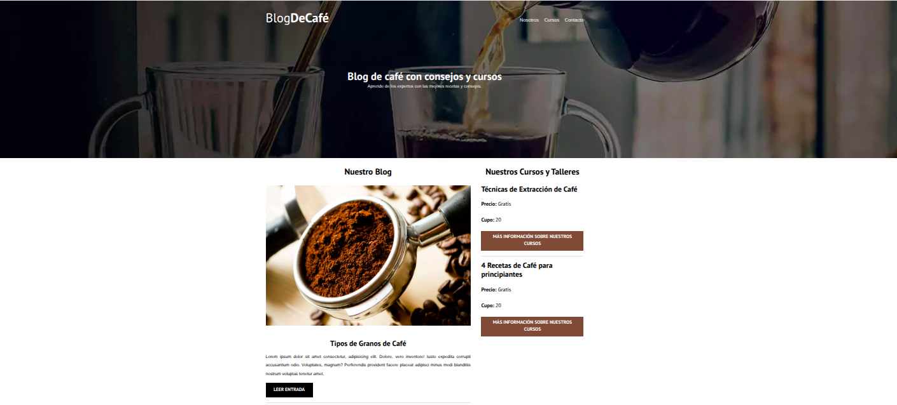
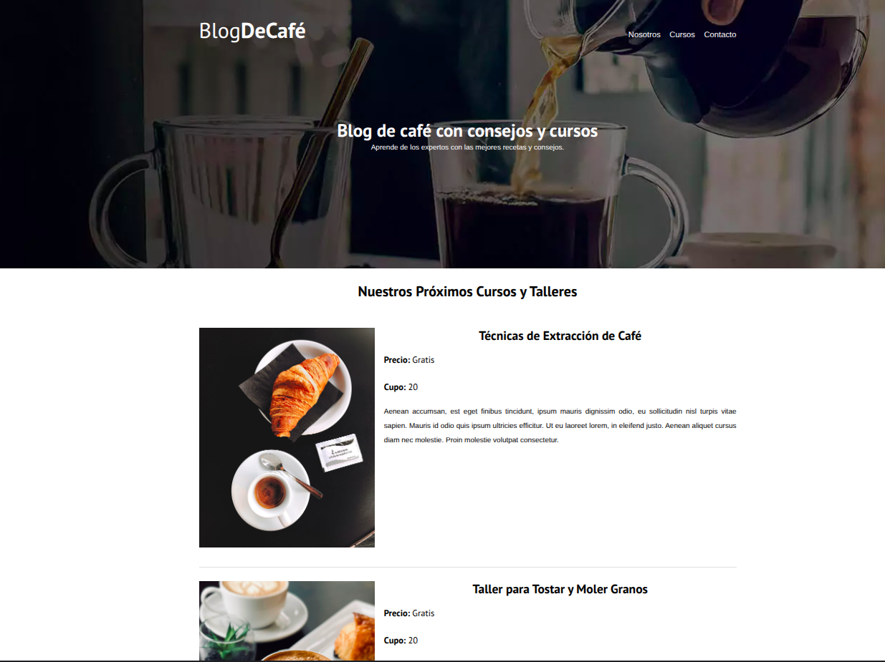
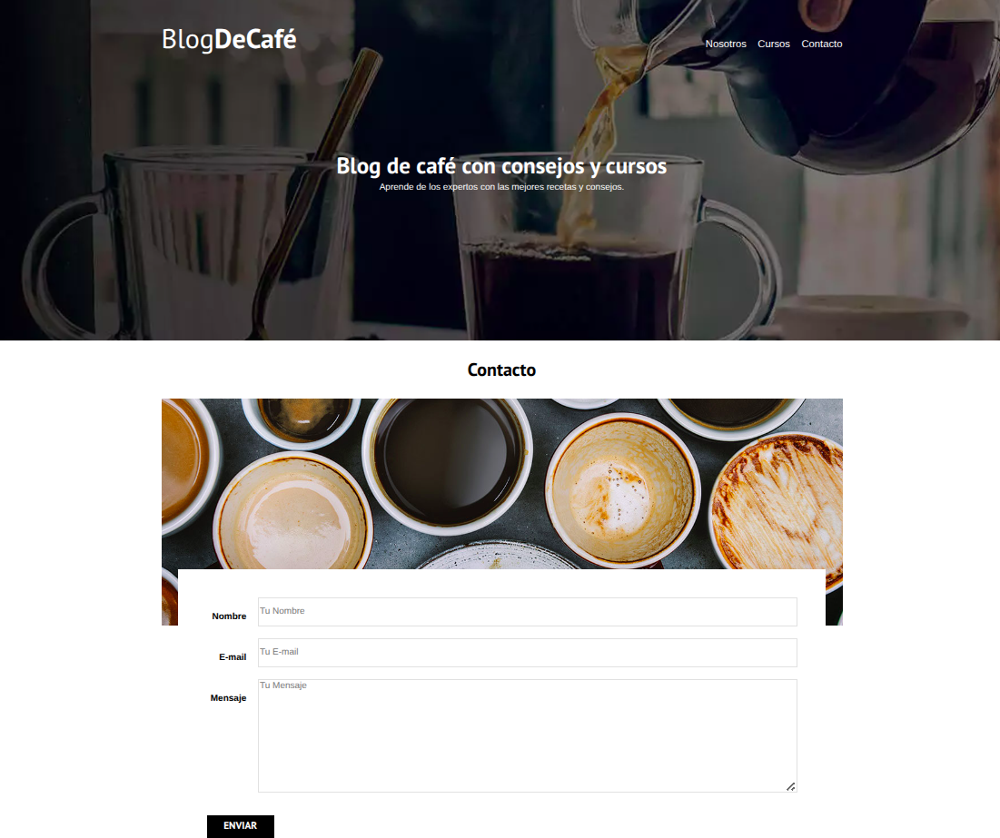

# Desarrollo-Web-FullStack

Colección de prácticas y proyectos desarrollados durante el curso de Desarrollo Web Completo utilizando HTML5, CSS3, JavaScript, AJAX, PHP y MySQL.

El repositorio documenta el aprendizaje progresivo de tecnologías de desarrollo web, comenzando con la construcción de interfaces estáticas mediante HTML y CSS. Conforme avance el curso, se incorporarán nuevos proyectos y tecnologías orientadas al desarrollo frontend y backend.

## Tecnologías Utilizadas

- HTML5
- CSS3

## Contenido del Repositorio

### HTML y CSS

Prácticas enfocadas en:

- Maquetación web.
- Diseño responsivo.
- Flexbox.
- CSS Grid.
- Formularios.
- Diseño de interfaces.
- Metodología BEM.
- Organización de recursos y estilos.

#### Freelancer

Página web orientada a la promoción de servicios profesionales.

<p align="center">
    <br>
    <em>Figura 1. Página principal del proyecto Freelancer.</em><br>
</p>

Conceptos aplicados:

- HTML semántico.
- Flexbox.
- CSS Grid.
- Formularios.
- Responsive Design.
- Variables CSS.
- Normalize.css.

#### Frontend Store

Sitio web tipo tienda en línea con múltiples páginas y catálogo de productos.

<p align="center">
    <br>
    <em>Figura 2. Página principal del catálogo de productos.</em><br><br>
</p>

<p align="center">
    <br>
    <em>Figura 3. Vista individual de producto.</em><br>
</p>

Conceptos aplicados:

- Metodología BEM.
- CSS Grid.
- Responsive Design.
- Navegación entre páginas.
- Diseño de catálogo de productos.
- Página de producto.
- Diseño adaptable para dispositivos móviles.

#### Patrones Responsive Web Design (RWD)

Colección de ejemplos orientados al aprendizaje y comparación de técnicas de diseño responsivo utilizando CSS Grid y Flexbox.

<p align="center">
    <br>
    <em>Figura 4. Ejemplo del patrón responsive Layout Shifter.</em><br>
</p>


Patrones implementados:

- Two Columns.
- Three Columns.
- Column Drop.
- Sidebar Layout.
- Layout Shifter.
- Mostly Fluid.
- Tiny Tweaks.

Tecnologías utilizadas:

- Flexbox.
- CSS Grid.
- Responsive Design.
- Media Queries.

#### Blog De Café

Sitio web multipágina orientado a la publicación de contenido relacionado con el café, incluyendo artículos de blog, cursos, talleres y un formulario de contacto.

<p align="center">
    <br>
    <em>Figura 5. Página principal del Blog de Café.</em><br><br>
</p>

<p align="center">
    <br>
    <em>Figura 6. Página de cursos y talleres disponibles.</em><br><br>
</p>

<p align="center">
    <br>
    <em>Figura 7. Formulario de contacto del sitio web.</em>
</p>

**Conceptos aplicados:**

- HTML semántico.
- CSS Grid.
- Flexbox.
- Responsive Design.
- Metodología BEM.
- Formularios web.
- Lazy Loading de imágenes.
- Optimización mediante Preload, Prefetch y Preconnect.
- Imágenes WebP con Modernizr.
- Normalize.css.
- Organización modular de estilos.
- Navegación multipágina.


## Estructura del Proyecto

```text
Desarrollo-Web-FullStack/
│
├── screenshots/
│   ├── freelancer_pc.png
│   ├── frontend_store_inicio.png
│   ├── frontend_store_producto.png
│   ├── layout_shifter_pc.png
│   ├── blogdecafe_inicio.png
│   ├── blogdecafe_cursos.png
│   └── blogdecafe_contacto.png
│
├── html-css/
│   ├── Freelancer/
│   ├── FrontEnd-Store/
│   ├── Patrones-RWD/
│   └── BlogDeCafe/
│
├── README.md
└── .gitignore
```

## Conceptos Aplicados

Durante el desarrollo de estas prácticas se han aplicado conocimientos en:

- HTML semántico.
- CSS moderno.
- Responsive Design.
- CSS Grid.
- Flexbox.
- Metodología BEM.
- Diseño de formularios.
- Organización modular de recursos web.
- Optimización básica de carga de recursos.
- Lazy Loading.
- Imágenes WebP.
- Preload, Prefetch y Preconnect.
- Navegación multipágina.

## Autor

- Suárez Vega, Vladimir

## Nota

Repositorio utilizado para documentar el progreso y desarrollo de proyectos realizados durante el curso de Desarrollo Web Completo.

**IMPORTANTE:**

Se aclara que al momento de la publicación inicial de este repositorio, el curso en el que se desarrollan estas prácticas y proyectos aún está en proceso. Por ello, el contenido, las tecnologías utilizadas, la estructura del proyecto y la documentación se actualizarán conforme se completen nuevos módulos y proyectos.

### Historial del Proyecto

- Creación del repositorio y publicación de primeros proyectos HTML5 y CSS3: **16 de julio de 2026**.
- Prácticas de patrones de Responsive Web Design (RWD): **17 de julio de 2026**.
- Incorporación del proyecto multipágina Blog De Café: **21 de julio de 2026**.